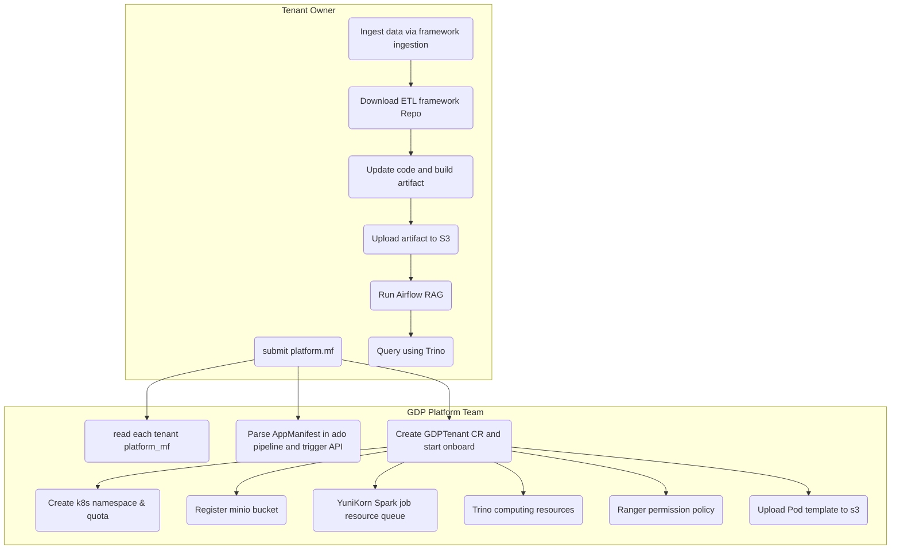

# 55547-gdp-app-onboarding

## Overview

**55547-gdp-app-onboarding** is an automated onboarding system for multi-tenant big data platforms. It streamlines the process of tenant registration, resource provisioning, and permission configuration across Kubernetes, MinIO, Trino, Ranger, and other components. The project is designed to help both platform teams and tenant owners efficiently manage and operate their data workloads in a secure, scalable, and cloud-native environment.

---

## Features

- **Automated Tenant Onboarding:**
  Parses tenant manifests and provisions all required resources automatically.
- **Kubernetes Native:**
  Creates namespaces, resource quotas, and YuniKorn queues for each tenant.
- **Object Storage Integration:**
  Registers MinIO buckets for tenant data storage.
- **Compute Resource Management:**
  Configures Trino resource groups and selectors for tenant compute isolation.
- **Data Governance:**
  Applies Ranger policies for fine-grained data access control.
- **Extensible Workflow:**
  Supports integration with Airflow, DataHub, Kafka, and more.
- **Concurrent Processing:**
  Handles multiple tenants in parallel with robust error aggregation.

---

## Quick Start

### Prerequisites

- Go 1.18+
- Kubernetes cluster
- MinIO, Trino, Ranger, YuniKorn deployed
- [kubebuilder](https://book.kubebuilder.io/)

### Initialization

```bash
kubebuilder init --domain standardchartered.com
kubebuilder create api --group gdp --version v1 --kind GTenant
make generate
make manifests
```

---

## Onboarding Workflow



---

## Directory Structure

- `pkg/tenant/`
  Core logic for onboarding, resource creation, and integration with external systems.
- `pkg/model/`
  Data models and manifest definitions.
- `pkg/constants/`
  Project-wide constants.
- `charts/`
  Helm charts for deployment.
- `files/`
  Example manifests and configuration files.

---

## TODO

- Grafana dashboard integration
- ResourceQuota enhancements
- Pod limit enforcement
- Default configmap management
- Scheduled tenant reconciliation

---

## Contribution

Contributions are welcome! Please open issues or submit pull requests for improvements and bug fixes.

---

## License

This project is for internal use at Standard Chartered. For licensing or usage inquiries, please contact the GDP platform